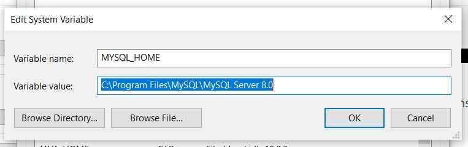
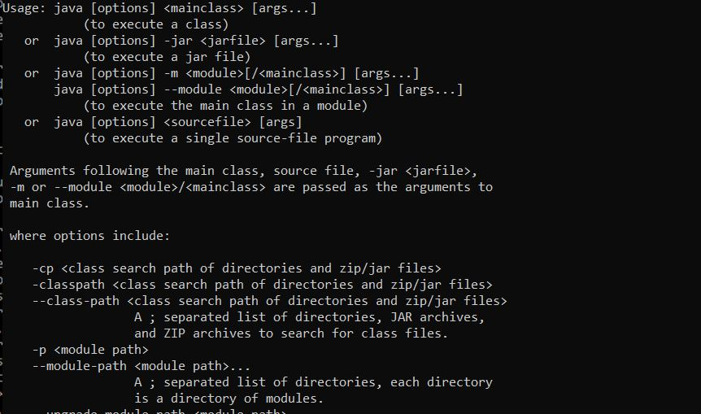

Coverage: 78%
# Inventory Management System (IMS)

This project is an inventory management system which takes user input via the command-line interface. The user can interact with Customers Items and Orders and can create update an delete each. The user can also add items to the orders. This will update the total price of the order and the stock of that item.

## Getting Started

These instructions will detail how to get a copy of the project up and running on a local machine for development and testing purposes. It should be noted that these instructions are based on a Windows system.

### Prerequisites

#### Git

Git is a version control system to track changes to the project and push these changes to the repository. It can be downloaded and installed [here](https://git-scm.com/downloads).

**Installing Git**

* Download the installer and run it.
* Work through the setup pages selecting the most appropriate options, the below are some recommended selections.
* It is recommended that the default branch name is set as main.
* Select to use Git from Git Bash and the command line.

**Configuring Git**

* Open Git Bash then enter the following

```
git config --global user.name "username"
git config --global user.email "email@email.com"
```
* Using the same credentials as GitHub (see below) is recommended.

#### GitHub

GitHub can be used to manage the source control of the project. It is free to sign up for an account [here](https://github.com/).

**Forking the GitHub Repository**

* On GitHub navigate to the main page of the repository.
* The 'Fork' button can be found on the top right-hand side of the screen.
* Click the button to create a copy of the original repository.

**Cloning the Repository to a Local Machine**

* On GitHub navigate to the main page of the repository.
* Above the list of folders and files select Code and in the HTTPS section copy the URL.
* Open Git Bash.
* Using the cd command change the current working directory to the location required for the cloned directory.
* Type git clone and paste in the copied url and press Enter to create the local clone.

#### MySQL Server

MySQL can be used to manage and test the database interactions and can be downloaded and installed [here](https://dev.mysql.com/downloads/windows/installer/8.0.html).

**Installing MySQL Server**

* Download and run the installer.
* Chose custom Setup Type.
* From the select products page select the newest versions of MySQLServer (MySQL Servers), MySQL Workbench (Applications).
* Cycle through the new few options by clicking next or execute.
* On the Accounts and Roles page enter a password for the root account. It is recommended that this is easy to remember and not sensitive (it will be copied to GitHub).
* Cycle through the next few options and on the connecter server page enter the root password to check the connection.
* Cycle through the next few windows and click finish.

**Setting up a MySQL Environment Variable**

* In the Start Menu search for 'env' then select 'edit the system environment variables'.
* Select environment variables.
* At the bottom under system variables select new then enter the following then select ok (note the value should point to the folder where MySQL is installed)



* Still within the system variables select Path then Edit. In the window that opens select New and then at the bottom add %MYSQL_HOME%\bin
* Click OK on all the windows to confirm.
* From the start menu search for MySQL select the MySQL command line client and login using the root password.
* MySQL server should now be set-up. It is recommended that it is used via MySQL Workbench.

#### Java

Java is the back-end development language used for this project downloads for it can be found [here](https://www.oracle.com/java/technologies/downloads/).

**Installing Java**

* Download and run the Java Development kit one of the latest versions.
* Install using default settings.

**Setting up Java Environment Variable**

* In the Start Menu search for 'env' then select 'edit the system environment variables'.
* Select environment variables.
* At the bottom under system variables select new then enter the following then select ok (note the value should point to the folder where Java jdk is installed)


* Still within the system variables select Path then Edit. In the window that opens select New and then at the bottom add %JAVA_HOME%\bin
* Click OK on all the windows to confirm.
* To confirm successful installation open a command prompt and enter java an output similar to the below should be seen.



#### Maven

Maven is used as a build automation tool for the project. It also allows the running of the unit tests it can be downloaded [here](https://maven.apache.org/).

**Installing Maven**

* Download the zip directory.
* Extract the files into an appropriate folder.

**Setting up Maven Environment Variable**

* In the Start Menu search for 'env' then select 'edit the system environment variables'.
* Select environment variables.
* At the bottom under system variables select new twice to enter two new variables M2_HOME and MAVEN_HOME both pointing to the Maven directory (see above for more detailed instructions).
* Still within the system variables select Path then Edit. In the window that opens select New and then at the bottom add %MAVEN_HOME%\bin
* Click OK on all the windows to confirm.
* To confirm successful installation open a command prompt and enter mvn -version.

#### Eclipse

Eclipse has been used as an Integrated Development Environment (IDE) for this project it can be downloaded and installed [here](https://www.eclipse.org/downloads/).

**Installing Eclipse**

* Download and run the installer.
* Select Eclipse IDE for Java Developers.
* Select install.

### Installing

A step by step series of examples that tell you how to get a development env running

Say what the step will be

```
Give the example
```

And repeat

```
until finished
```

End with an example of getting some data out of the system or using it for a little demo

## Running the tests

Explain how to run the automated tests for this system. Break down into which tests and what they do

### Unit Tests 

Explain what these tests test, why and how to run them

```
Give an example
```

### Integration Tests 
Explain what these tests test, why and how to run them

```
Give an example
```

### And coding style tests

Explain what these tests test and why

```
Give an example
```

## Deployment

Add additional notes about how to deploy this on a live system

## Built With

* [Maven](https://maven.apache.org/) - Dependency Management

## Versioning

We use [SemVer](http://semver.org/) for versioning.

## Authors

* **Chris Perrins** - *Initial work* - [christophperrins](https://github.com/christophperrins)

## License

This project is licensed under the MIT license - see the [LICENSE.md](LICENSE.md) file for details 

*For help in [Choosing a license](https://choosealicense.com/)*

## Acknowledgments

* Hat tip to anyone whose code was used
* Inspiration
* etc
# IMS-Start
# IMS-Start
